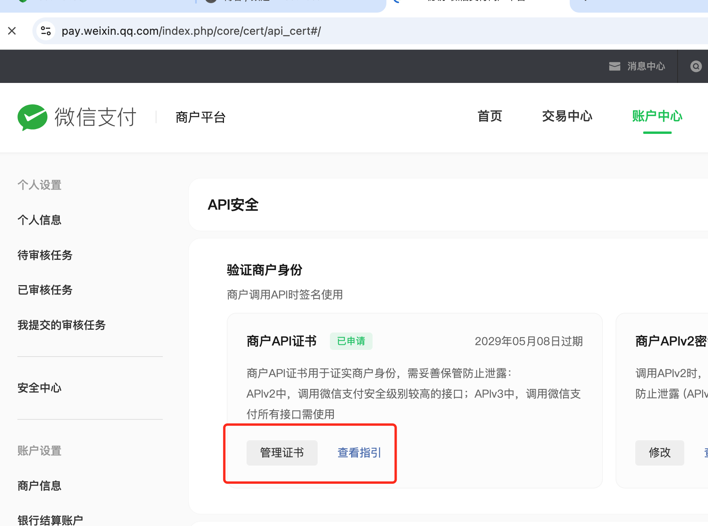

---
date:
  created: 2024-10-31
  updated: 2024-10-31
readtime: 15
pin: true
links:
  - Homepage: index.md
  - Blog index: blog/index.md
  - External links:
      - fastx-ai: https://fastx-ai.com
categories:
  - 微信业务
tags:
  - 小程序支付
  - 微信支付
authors:
  - team
---

# 微信小程序支付篇

我们尽量用简单直白的内容，最快速的解决小程序支付的问题；

初期的配置这里不做赘述，请配置服务器域名到微信支付、小程序的业务等域名中；

- [x] 小程序框架：uni-app + vscode
- [x] 服务端框架：spring-boot + wx 官方java sdk

小程序部分代码非常简单：

```javascript
const wxPay = async () => {
  const payParams = {
    amount: 10, // 支付的金额，单位为 `分`
    openid: userInfo.openId, // 你的 openId；当然也可以服务端通过访问用户的一些身份信息识别出来自动填充；
  };
  const res = await post("pay/unifiedOrder", payParams); // 调用服务端统一下单接口
  
  if (res.code === 200) {
    wx.requestPayment({ // 小程序发起支付
      ...res.data,
      package: res.data.packageVal, // 我们直接把微信官方 sdk 的内容丢到了 res.data 里；但是微信的返回参数中，有一个字段不符合后面的参数逻辑；所以要单独做一下转换；
      success(resp) {
        console.log("pay success", resp);
      },
      fail(err) {
        console.error("pay fail", err);
      },
    });
  }
};
```

<!-- more -->

服务端内容：

依赖最新版本的 V3 SDK；

```xml hl_lines="3 4 5" linenums="1" title="pom.xml"
<!-- https://mvnrepository.com/artifact/com.github.wechatpay-apiv3/wechatpay-java -->
<dependency>
  <groupId>com.github.wechatpay-apiv3</groupId>
  <artifactId>wechatpay-java</artifactId>
  <version>0.2.14</version>
</dependency>
```

初始化配置项：（因为小程序是 JSAPI 下单方式，所以这里引入了相关包以及类；如果是其他方式，请直接查看源码目录下其他文件夹即可。

```java linenums="1" title="utils.java"
// ...
import com.wechat.pay.java.core.Config;
import com.wechat.pay.java.core.RSAAutoCertificateConfig;
import com.wechat.pay.java.core.exception.ValidationException;
import com.wechat.pay.java.core.notification.NotificationConfig;
import com.wechat.pay.java.core.notification.NotificationParser;
import com.wechat.pay.java.core.notification.RequestParam;
import com.wechat.pay.java.service.payments.jsapi.JsapiServiceExtension;
import com.wechat.pay.java.service.payments.jsapi.model.*;
import com.wechat.pay.java.service.payments.model.Transaction;
// ...

    /** 商户号 */
    public static String merchantId = "16********";
    /** 商户API私钥路径 */
    public static String privateKeyPath = "/www/xxx/xxx/apiclient_key.pem"; // 这里需要把证书上传到服务器的绝对路径；当然这是一个偷懒的办法；更好的办法是通过 github 上 wechatpay-java 项目的 README.md 内容进行动态的更新证书；特别注意使用这个文件： apiclient_key.pem 
    /** 商户证书序列号 */
    public static String merchantSerialNumber = "1CC*************************";  // 证书序列号
    /** 商户ApiV3密钥 */
    public static String apiV3key = "NM**************************"; // API V3密钥；

    private static Config config = new RSAAutoCertificateConfig.Builder()
        .merchantId(merchantId)
        .privateKeyFromPath(privateKeyPath)
        .merchantSerialNumber(merchantSerialNumber)
        .apiV3Key(apiV3key)
        .build();
```



编写接口

```java linenums="1" title="request.java"
    @PostMapping("/unifiedOrder")
    public Result<PrepayWithRequestPaymentResponse> unifiedOrder(@RequestBody PayRequest payRequest) throws WxPayException {
        JsapiServiceExtension service = new JsapiServiceExtension.Builder().config(config).build();

        PrepayRequest request = new PrepayRequest();
        Amount amount = new Amount();
        amount.setTotal(payRequest.getAmount());
        request.setAmount(amount);
        request.setAppid("wx**********"); // 这里需要填写你的 AppId；比如绑定该商户的公众号或者小程序的 AppId
        request.setMchid("16******"); // 这里填写上面的商户 Id
        request.setDescription("打赏我们吧！"); // 描述
        request.setNotifyUrl("xxx.com/pay/notify/order"); // 回调地址，也就是下面的地址；记得在 handler 中放行该接口
        request.setOutTradeNo(String.valueOf(generator.generateId())); // 订单号；这里我们使用了 snowflake 生成外部订单号
        request.setAttach(attach); // 业务附加内容
        Payer payer = new Payer();
        payer.setOpenid(payRequest.getOpenid()); // 支付人的 openId；比如小程序的用户的 openId；关于 OpenId 的获取方式，我们在文末会提及
        request.setPayer(payer);

        PrepayWithRequestPaymentResponse response = service.prepayWithRequestPayment(request);

        return Result.OK(response); //  返回支付结果
    }

    @PostMapping("/notify/order")
    public Result<Boolean> parseOrderNotifyResult(HttpServletRequest request, HttpServletResponse response)
            throws WxPayException {
        String timestamp = request.getHeader("Wechatpay-Timestamp");
        String nonce = request.getHeader("Wechatpay-Nonce");
        String signature = request.getHeader("Wechatpay-Signature");
        String singType = request.getHeader("Wechatpay-Signature-Type");
        String number = request.getHeader("Wechatpay-Serial");
        String body = getRequestBody(request);

        RequestParam requestParam = new RequestParam.Builder().nonce(nonce).signature(signature).signType(singType)
                .timestamp(timestamp).serialNumber(number).body(body).build();
        // 初始化 NotificationParser
        NotificationParser parser = new NotificationParser((NotificationConfig) config);

        try {
            // 以支付通知回调为例，验签、解密并转换成 Transaction
            Transaction transaction = parser.parse(requestParam, Transaction.class);
            if (transaction.getTradeState() == Transaction.TradeStateEnum.SUCCESS) {
                log.info("trade success {}", transaction.getPayer().getOpenid());
            }
        } catch (ValidationException e) {
            // 签名验证失败，返回 401 UNAUTHORIZED 状态码
            log.error("sign verification failed", e);
            response.setStatus(HttpStatus.UNAUTHORIZED.value());
            throw e;
        }
        return Result.OK();
    }

    private String getRequestBody(HttpServletRequest request) {
        StringBuilder sb = new StringBuilder();
        try (ServletInputStream inputStream = request.getInputStream();
             BufferedReader reader = new BufferedReader(new InputStreamReader(inputStream));) {
            String line;
            while ((line = reader.readLine()) != null) {
                sb.append(line);
            }
        } catch (IOException e) {
            log.error("get wx notify data error", e);
        }
        return sb.toString();
    }
```

小程序支付的具体代码内容只有上述，非常简单；但是我们在真正使用的时候，踩到了很多坑；比如证书格式、参数传递、回调解密等等。非常感谢网络上有大量分享内容的作者。

接下来是关于小程序登录的一些细节，如果您已经可以获取 OpenId 可以省略这一段内容。

小程序端首先需获取 code ，将该 code 传递给后端，后端请求微信服务器即可正常获得小程序 openId；由于我们使用了uni-app，所以这里直接使用 uni-app 提供的获取 code 办法；

```javascript linenums="1" title="wx.vue"
uni.login({
  provider: "weixin",
  success: resolve, // 在success 中可以获得 code；
  fail: reject,
});

const resp = await get("/user/wxLogin", { code: res.code }); // 将上一步获取到的 code 传递给服务器即可
console.log("userInfo: ", resp);
```

服务端代码也比较简单，首先我们需要增加一个开源框架：版本号可以到 maven central 中加载最新。

```xml hl_lines="2 3 4" linenums="1" title="pom.xml"
<dependency>
  <groupId>com.github.binarywang</groupId>
  <artifactId>weixin-java-miniapp</artifactId>
  <version>4.6.5.B</version>
</dependency>
```

```java linenums="1" title="login.java"
    @Bean // 首先我们需要一个 Bean 来初始化该框架；传参非常的简单；
    public WxMaService wxMaService() {
        WxMaService maService = new WxMaServiceImpl();
        maService.setMultiConfigs(); // 这里可以设置多个配置；同一服务器上同时可以绑定多了微信类业务

        // 这里只提供单一示例；
        WxMaDefaultConfigImpl config = new WxMaDefaultConfigImpl();
        config.setAppid(a.getAppid()); // 小程序的 appId
        config.setSecret(a.getSecret()); // 小程序的 secret
        config.setToken(a.getToken()); // 小程序中配置的 token
        config.setAesKey(a.getAesKey()); // 小程序中配置的 key
        config.setMsgDataFormat(a.getMsgDataFormat()); // 配置：JSON 即可
        // 将 config 添加到上述内容中即可

        return maService;
    }

    @Autowired // 配置完成后，在需要的 Service 或者 Controller 中注入使用即可
    WxMaService wxMaService;

    @GetMapping("/wxLogin") // 开放给前端调用的接口
    public Result<User> wxLogin(@RequestParam String code) throws WxErrorException {
        Assert.hasText(code, "code is null!");

        try {
            WxMaJscode2SessionResult session = wxMaService.getUserService().getSessionInfo(code);
            Assert.hasText(session.getOpenid(), "not found open_id for this user!");
            //auto add user to db auto;
            return Result.OK(session.getOpenid()); // Session.OpenId 即我们需要使用的 OpenId
        } catch (WxErrorException e) {
            throw e;
        } finally {
            // clean the thread local
            WxMaConfigHolder.remove();
        }
    }
```

使用恰当的开源框架可以避免重复造轮子，因为大部分的坑作者已经踩过，我们没必要浪费时间去踩。学会站在巨人的肩膀上同样是一件非常重要的事。当然，这个前提是，恰当的开源框架。

不恰当通常包括：过时、不维护、开源协议不符合公司要求、等等
当然有的时候，恰当的开源框架也让人非常的恼火，比如 alibaba-fastjson 经常有漏洞升级的事情，我们已经做了上百次了。

好了，祝你幸福。
