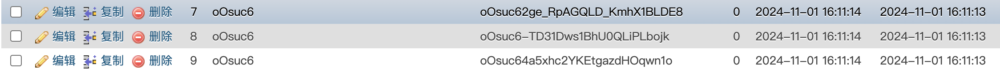
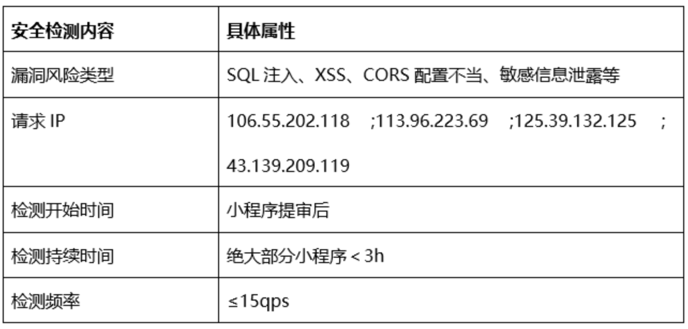

---
date:
  created: 2024-11-01
  updated: 2024-11-01
readtime: 10
pin: true
links:
  - Homepage: index.md
  - Blog index: blog/index.md
  - External links:
      - fastx-ai: https://fastx-ai.com
categories:
  - 微信业务
tags:
  - 小程序支付
  - 微信支付
authors:
  - team
---

# 记一次微信小程序后台被攻击的趣事

线上突然收到大量的异常报警（error 日志的数量达到一定量），查阅报警内容如下：

```java linenums="1" title="error.log"
[2024-11-01 17:26:48,408][INFO][http-nio-8282-exec-4][c.b.c.c.Http][Http.java:38][110670940588740608] GET|3|/room/getFatRoomPoints|106.55.202.118|null
[2024-11-01 17:26:48,868][ERROR][http-nio-8282-exec-6][c.b.w.c.e.ExceptionHandlingController][ExceptionHandlingController.java:19][110670942534897664]
org.springframework.web.method.annotation.MethodArgumentTypeMismatchException: Failed to convert value of type 'java.lang.String' to required type 'java.lang.Long'; For input string: "'AND(SELECT*FROM(SELECT(SLEEP(3)))rsuv)limit1#"
at org.springframework.web.method.annotation.AbstractNamedValueMethodArgumentResolver.convertIfNecessary(AbstractNamedValueMethodArgumentResolver.java:302)
at org.springframework.web.method.annotation.AbstractNamedValueMethodArgumentResolver.resolveArgument(AbstractNamedValueMethodArgumentResolver.java:137)
at org.springframework.web.method.support.HandlerMethodArgumentResolverComposite.resolveArgument(HandlerMethodArgumentResolverComposite.java:122)
at org.springframework.web.method.support.InvocableHandlerMethod.getMethodArgumentValues(InvocableHandlerMethod.java:224)
at org.springframework.web.method.support.InvocableHandlerMethod.invokeForRequest(InvocableHandlerMethod.java:178)
at org.springframework.web.servlet.mvc.method.annotation.ServletInvocableHandlerMethod.invokeAndHandle(ServletInvocableHandlerMethod.java:118)
at org.springframework.web.servlet.mvc.method.annotation.RequestMappingHandlerAdapter.invokeHandlerMethod(RequestMappingHandlerAdapter.java:926)
at org.springframework.web.servlet.mvc.method.annotation.RequestMappingHandlerAdapter.handleInternal(RequestMappingHandlerAdapter.java:831)
at org.springframework.web.servlet.mvc.method.AbstractHandlerMethodAdapter.handle(AbstractHandlerMethodAdapter.java:87)
at org.springframework.web.servlet.DispatcherServlet.doDispatch(DispatcherServlet.java:1089)
at org.springframework.web.servlet.DispatcherServlet.doService(DispatcherServlet.java:979)
at org.springframework.web.servlet.FrameworkServlet.processRequest(FrameworkServlet.java:1014)
at org.springframework.web.servlet.FrameworkServlet.doGet(FrameworkServlet.java:903)
at jakarta.servlet.http.HttpServlet.service(HttpServlet.java:564)
at org.springframework.web.servlet.FrameworkServlet.service(FrameworkServlet.java:885)
at jakarta.servlet.http.HttpServlet.service(HttpServlet.java:658)
at org.apache.catalina.core.ApplicationFilterChain.internalDoFilter(ApplicationFilterChain.java:195)
at org.apache.catalina.core.ApplicationFilterChain.doFilter(ApplicationFilterChain.java:140)
at org.apache.tomcat.websocket.server.WsFilter.doFilter(WsFilter.java:51)
at org.apache.catalina.core.ApplicationFilterChain.internalDoFilter(ApplicationFilterChain.java:164)
at org.apache.catalina.core.ApplicationFilterChain.doFilter(ApplicationFilterChain.java:140)
at org.springframework.web.filter.RequestContextFilter.doFilterInternal(RequestContextFilter.java:100)
at org.springframework.web.filter.OncePerRequestFilter.doFilter(OncePerRequestFilter.java:116)
at org.apache.catalina.core.ApplicationFilterChain.internalDoFilter(ApplicationFilterChain.java:164)
at org.apache.catalina.core.ApplicationFilterChain.doFilter(ApplicationFilterChain.java:140)
at org.springframework.web.filter.FormContentFilter.doFilterInternal(FormContentFilter.java:93)
at org.springframework.web.filter.OncePerRequestFilter.doFilter(OncePerRequestFilter.java:116)
at org.apache.catalina.core.ApplicationFilterChain.internalDoFilter(ApplicationFilterChain.java:164)
at org.apache.catalina.core.ApplicationFilterChain.doFilter(ApplicationFilterChain.java:140)
at org.springframework.web.filter.ServerHttpObservationFilter.doFilterInternal(ServerHttpObservationFilter.java:113)
at org.springframework.web.filter.OncePerRequestFilter.doFilter(OncePerRequestFilter.java:116)
at org.apache.catalina.core.ApplicationFilterChain.internalDoFilter(ApplicationFilterChain.java:164)
at org.apache.catalina.core.ApplicationFilterChain.doFilter(ApplicationFilterChain.java:140)
at org.springframework.web.filter.CharacterEncodingFilter.doFilterInternal(CharacterEncodingFilter.java:201)
at org.springframework.web.filter.OncePerRequestFilter.doFilter(OncePerRequestFilter.java:116)
at org.apache.catalina.core.ApplicationFilterChain.internalDoFilter(ApplicationFilterChain.java:164)
at org.apache.catalina.core.ApplicationFilterChain.doFilter(ApplicationFilterChain.java:140)
at org.apache.catalina.core.StandardWrapperValve.invoke(StandardWrapperValve.java:167)
at org.apache.catalina.core.StandardContextValve.invoke(StandardContextValve.java:90)
at org.apache.catalina.authenticator.AuthenticatorBase.invoke(AuthenticatorBase.java:483)
at org.apache.catalina.core.StandardHostValve.invoke(StandardHostValve.java:115)
at org.apache.catalina.valves.ErrorReportValve.invoke(ErrorReportValve.java:93)
at org.apache.catalina.core.StandardEngineValve.invoke(StandardEngineValve.java:74)
at org.apache.catalina.connector.CoyoteAdapter.service(CoyoteAdapter.java:344)
at org.apache.coyote.http11.Http11Processor.service(Http11Processor.java:384)
at org.apache.coyote.AbstractProcessorLight.process(AbstractProcessorLight.java:63)
at org.apache.coyote.AbstractProtocol$ConnectionHandler.process(AbstractProtocol.java:905)
at org.apache.tomcat.util.net.NioEndpoint$SocketProcessor.doRun(NioEndpoint.java:1741)
at org.apache.tomcat.util.net.SocketProcessorBase.run(SocketProcessorBase.java:52)
at org.apache.tomcat.util.threads.ThreadPoolExecutor.runWorker(ThreadPoolExecutor.java:1190)
at org.apache.tomcat.util.threads.ThreadPoolExecutor$Worker.run(ThreadPoolExecutor.java:659)
at org.apache.tomcat.util.threads.TaskThread$WrappingRunnable.run(TaskThread.java:63)
at java.base/java.lang.Thread.run(Thread.java:1583)
Caused by: java.lang.NumberFormatException: For input string: "'AND(SELECT*FROM(SELECT(SLEEP(3)))rsuv)limit1#"
at java.base/java.lang.NumberFormatException.forInputString(NumberFormatException.java:67)
at java.base/java.lang.Long.parseLong(Long.java:695)
at java.base/java.lang.Long.valueOf(Long.java:1157)
at org.springframework.util.NumberUtils.parseNumber(NumberUtils.java:206)
at org.springframework.beans.propertyeditors.CustomNumberEditor.setAsText(CustomNumberEditor.java:115)
at org.springframework.beans.TypeConverterDelegate.doConvertTextValue(TypeConverterDelegate.java:439)
at org.springframework.beans.TypeConverterDelegate.doConvertValue(TypeConverterDelegate.java:412)
at org.springframework.beans.TypeConverterDelegate.convertIfNecessary(TypeConverterDelegate.java:161)
at org.springframework.beans.TypeConverterSupport.convertIfNecessary(TypeConverterSupport.java:80)
at org.springframework.beans.TypeConverterSupport.convertIfNecessary(TypeConverterSupport.java:53)
at org.springframework.validation.DataBinder.convertIfNecessary(DataBinder.java:860)
at org.springframework.web.method.annotation.AbstractNamedValueMethodArgumentResolver.convertIfNecessary(AbstractNamedValueMethodArgumentResolver.java:294)
... 52 common frames omitted
```

大家注意其中绿色的部分；`#!sql For input string: "'AND(SELECT*FROM(SELECT(SLEEP(3)))rsuv)limit1#"`，像极了一次 SQL 注入，可是我们的小程序才刚刚上线啊！于是继续整理出了相关日志内容如下：

```java
[2024-11-01 17:10:21,015][INFO][http-nio-8282-exec-8][c.b.c.c.Http][Http.java:38][110666799170719744] GET|0|/pointsHistory/list|43.139.209.119|null
[2024-11-01 17:10:21,202][INFO][http-nio-8282-exec-9][p6spy][Slf4JLogger.java:60][110666799950860288] sql|0|SELECT COUNT(*) AS total FROM points_history WHERE is_delete = 0 AND (user_id = '7)) AND (SELECT*FROM(SELECT(SLEEP(3)))klcp) limit 1#')
```

完整的 SQL 以及调用日志都有了，查询了调用的服务器 IP 地址为广东深圳的腾讯机房，于是猜测应该是小程序审核的代码安全检测吧？



于是，我们拿着数据咨询官方后，得到了一份公告内容，内容如下：

## 小程序安全检测上线公告官方

> 微信团队 2021-12-13

为进一步提升小程序的安全性和用户体验，目前平台将对提审的小程序进行安全检测，以便能及时帮助开发者发现小程序可能存在的安全漏洞。

### 一、背景介绍

小程序在开发过程中若存在安全漏洞的情况，如敏感数据篡改、拖库信息泄露、WEB攻击等，容易造成小程序的安全隐患，可能带来代码易被反编译、核心业务逻辑被破译、算法易被二次打包等风险。因此，平台将对提审的小程序进行安全检测，以协助开发者提升小程序服务的安全性，同时开发者也应加强自身小程序安全漏洞监测能力，保证可及时消除潜在的安全风险。

### 二、审核过程

安全检测过程中，平台会模拟真实业务场景，向提审小程序的后台发送服务请求，服务器会收到来自平台（显示为：Tencent Security Team，请求IP为106.55.202.118；113.96.223.69；125.39.132.125；43.139.209.119）的请求。该请求均以较低速率进行，正常情况下不会影响小程序的正常服务。若确实出现了影响小程序正常业务的特殊情况，如用户无法进行小程序的正常访问，开发者可基于自身业务情况，对相应请求加以限频，如有其他疑问，欢迎随时通过官方社区进行反馈。

### 三、审核结果

安全检测的结果是小程序审核的重要参考。若小程序在安全检测中被检测到存在安全漏洞，该小程序的审核将不予通过。开发者可根据扫描报告中的修改指引，对安全漏洞进行相应修复后，再重新进行提审。

### 其他常见问题

Q1：可以选择不进行安全检测吗，是否会影响小程序代码提审结果？

A1：安全检测是小程序审核的环节之一，所有提审的小程序均需进行，若检测中发现安全漏洞或小程序故意采取措施规避检测，该小程序的审核将不予通过。

Q2:若在小程序代码审核已结束或审核已撤销的情况下，可以停止安全检测吗？

A2:若在小程序代码审核已结束的情况下，平台将持续进行未完成的安全检测直至完成，如有需要，开发者可通过平台提供的相应链接（在【小程序管理后台 → 通知中心】查看站内信即可）自行中止安全检测；若在小程序审核已撤销的情况下，平台将自动中止未完成的安全检测。



小程序真是帮我们考虑了太多太多了，当然，这也关乎微信的声誉吧。小小虚惊一场，也高估了刚上线的小程序的流量 ಥ_ಥ :cry:

当然，我们同样要提到，一些必要的安全防范非常的重要，黑客会通过大量的扫描工具来不停的扫描公网的服务器，如果你有漏洞，就避免不了机器被拉去挖矿了。当然，安全是一门学问了，记得在上高中的时候，是中国红客联盟学生组的一名成员，俗称脚本小子们，也曾经参加过保卫祖国攻击日本政府网站的战役呢。在很多个日本的政府网都插上了中国的国旗。

现在想想，真的是有趣呢！清楚的记得一些工具，中国菜刀，阿D注入工具，御剑，X-scan 等等，还有各种各样的马，shell 等等。

好了，今天就到这里，祝你幸福。
