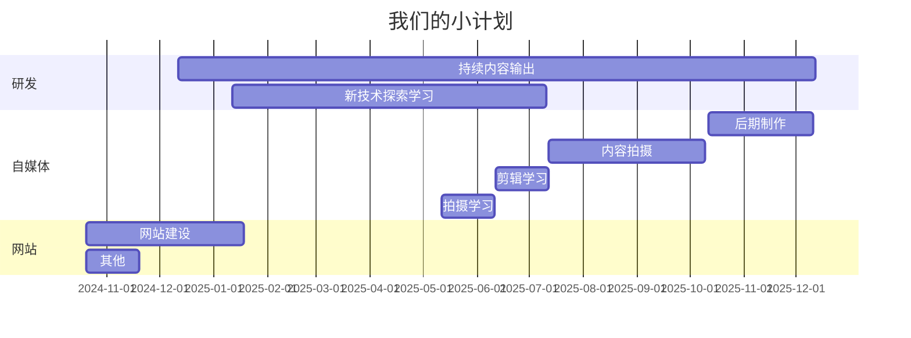

---
hide:
  - navigation
  - toc
---

# 欢迎访问 :smile:

> 访问光子人工智能网站获得基础 AI 服务 [fastx-ai.com](https://fastx-ai.com) :fontawesome-regular-face-laugh-wink:

所以，这个以文档（mkdocs + material）为主体网站的主要目的是什么呢？

- [x] 提供基础的 AI 服务，并且提供可定制的（企业知识库、agent、大数据）服务
- [x] 提供如下学习内容
    - [x] 基础的前端、后端、大数据、机器学习教学内容
    - [x] 基础的架构设计内容
    - [x] 常用的框架等内容
    - [x] 一些职场常用的软技能
- [x] 提供自媒体相关的素材、内容、服务等
- [x] 提供丰富的程序员外包资源，我们有来自
    - [x] 阿里的高级技术专家，主导 淘系交易中台设计
    - [x] 腾讯的客户端基础架构师，主导鸿蒙 QQ 研发
    - [x] 华为的架构师，主导华为企业级 APM 研发

所以，这是一个充满 :octicons-heart-fill-24:{ .heart } 的网站，我们希望可以在自身不断成长的过程中，输出良好的内容给行业的新鲜血液。另外，我们非常希望可以澄清以下几点：

- [x] 程序员短期内不可能被 AI 替代
- [x] 程序员是一个非常好的职业，是一个可以长期做的职业
- [x] 程序员的进阶之路非常不容易，但又非常容易

{ loading=lazy }

$$
终极程序员 = \sum_{k=0}^{\infty}硬技能^{软技能}
$$

:material-information-outline:{ title="Important information" } 这是一个非常好的公式，当你没有软技能的时候；光凭借硬技能也能走的很远；当你没有硬技能的时候，软技能也没什么大的作用；只有二者结合，才能让你变成 [埃隆马斯克](https://doc.fastx-ai.com "现实世界中我的偶像")、扎克伯格、斯蒂夫乔布斯等等闪耀的明星。

!!! info inline end "贴心小提示"

    千万不要在意自己的年龄，最差最差最差的结果，就是当个保安嘛，慌什么

## 程序员疯狂成长之路

- `小白程序员` - 通常，是那些门外汉吧，想要内窥程序员世界的那些人
- `入门程序员` - 搜索引擎、AI 生成、工具、框架、脚本小子
- `初级程序员` - **点** 代码编写能力以及问题解决能力
- `高级程序员` - **线** 有思考的解决某一类问题
- `超级程序员` - **面/体** 有思考的编写面向特定行业解决方案的程序员或者是研究员
- `其他程序员` - 拥有特殊方向特殊技能的有价值群体

## 程序员必备知识技能

??? 提示

    这里列出的知识技能总结来自于 "仅限于我们几位小伙伴的职场履历、创业履历的总结"

:man_raising_hand: 如果你也有好的经历经验技术技能愿意分享, 非常欢迎加入我们的大家庭。

那么，就请开始学习吧，为了当下而努力，为了未来自给自足而努力，为了能创造更多的价值而努力。

```py hl_lines="4" linenums="1" title="当下.py"
def day_day_up(items):
    for i in range(len(∞)):
        for j in range(len(∞)):
            ... # (1)
```

1. :man_raising_hand: 既然你好奇的点开了这里，我们就可以大概确定，你是一个拥有探索未知能力的人。

所以，在本文的结尾处，我们希望你可以拥有自己的 `当下和未来` ！

本网站涉及到的 **程序员相关内容** 内容包括但不限于如下技能：
=== "JAVA"

    ``` java
    import java.util.Scanner;
    ```

=== "GO"

    ``` go
    package main
    ```

=== "NextJS"

    ``` typescript
    const A = () => ();
    ```

=== "React"

    ``` typescript
    return (<></>)
    ```

=== "Vue"

    ``` vue
    <template setup>
    ```

=== "Flutter"

    ``` dart
    return fibonacci(n - 1) + fibonacci(n - 2);
    ```

=== "Android (Java)"

    ``` java
    setContentView(R.layout.first_layout);
    ```

=== "iOS/MacOS (OC/Swift)"

    ``` objective-c
    [UIView subViews];
    ```

=== "ML / LLMs (Python)"

    ``` python
    model = Sequential()
    ```

=== "大数据 (Java)"

    ``` java
    DataStream<Integer> listState  = savepoint.readUnionState<>(
        OperatorIdentifier.forUid("my-uid"),
        "union-state",
        Types.INT);
    ```

=== "运维 (Shell)"

    ``` shell
    kubectl get po, svc -A
    ```

!!! 内容样例

    === "JAVA"

        ``` markdown
        * JAVA 基础内容
        * JAVA 进阶内容
        * JAVA 职场必备基础知识
        * JAVA 职场必备进阶技能
        * JAVA 高性能调优
        * JAVA ...
        ```

    === "大数据"

        ``` markdown
        1. 大数据基础知识以及框架认识
        2. 大数据框架选型必看
        3. 大数据集群环境构建以及架构设计
        4. ...
        ```

| 负责人   | 内容方向                          |
| --------| ------------------------------------ |
| `LY`    | :material-check: 服务端、大数据、运维      |
| `ZY`    | :material-check-all: 客户端、服务端 |
| `CL`    | :material-check: 机器学习、客户端、服务端     |
| `YD`    | :material-check-all: 大数据、前端     |



<div class="grid cards" markdown>

-   :material-clock-fast:{ .lg .middle } __快速了解__

    ---

    快速了解 [`学习方式方法`](#)， [`然后`](#) 开始具体内容的学习

    [:octicons-arrow-right-24: 开始学习](#)

-   :material-format-font:{ .lg .middle } __还很迷茫__

    ---

    尝试通过 github 提交 issue 给我们，描述你的问题，我们会尽快回复您。

    [:octicons-arrow-right-24: 还没准备好？](#)

</div>

++ctrl+shift+f5++

如不能正产展示页面内容，可刷新本页面

[^1]: 本页面内容 光子人工智能 拥有全部解释权
[^2]: 本页面内容均受到版权保护，转载请注明出处
