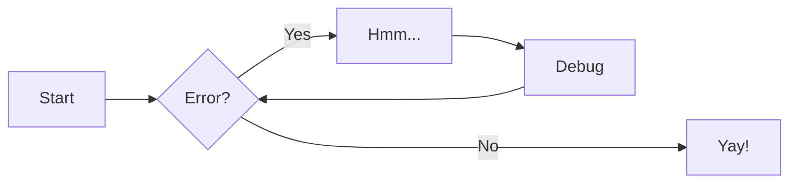
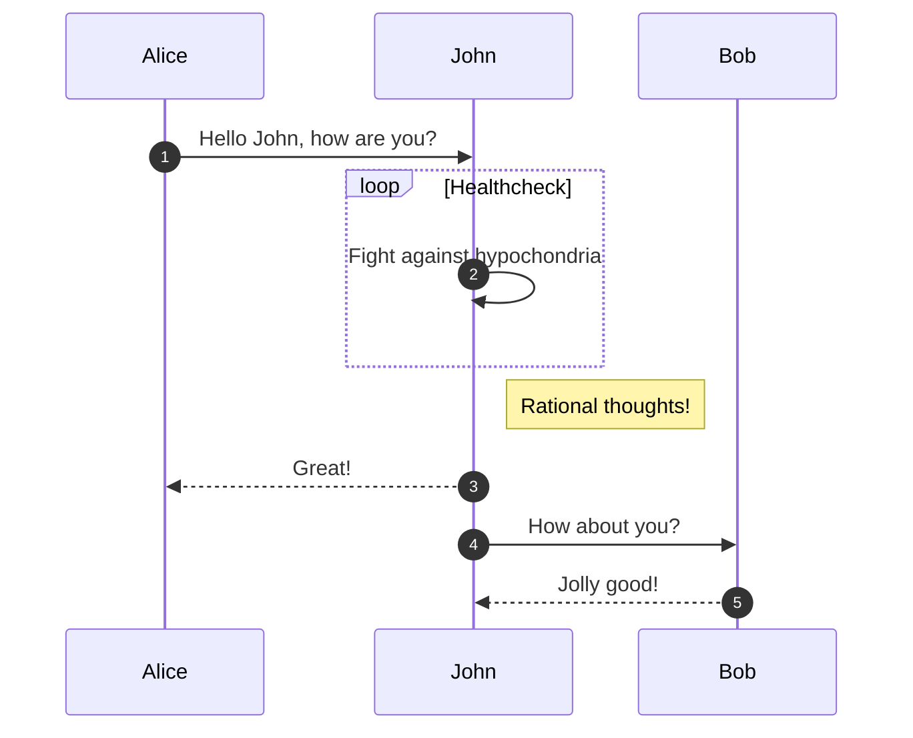
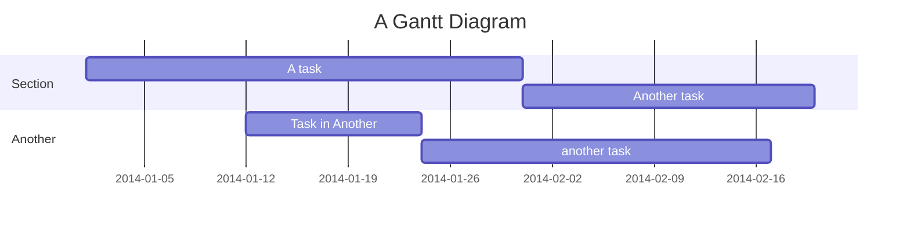
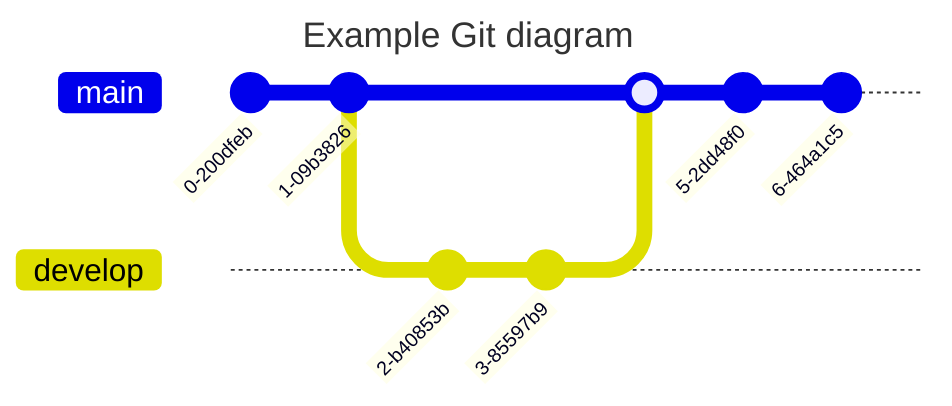
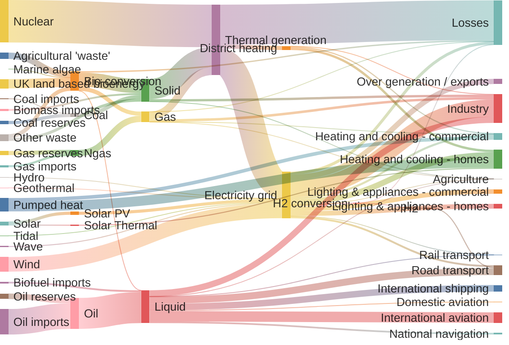

# Welcome to MkDocs

For full documentation visit [mkdocs.org](https://www.mkdocs.org).

:smile:
:fontawesome-regular-face-laugh-wink:
:fontawesome-brands-youtube:{ .youtube }
:octicons-heart-fill-24:{ .heart }

{ loading=lazy }

- [x] Lorem ipsum dolor sit amet, consectetur adipiscing elit
- [ ] Vestibulum convallis sit amet nisi a tincidunt
    * [x] In hac habitasse platea dictumst
    * [x] In scelerisque nibh non dolor mollis congue sed et metus
    * [ ] Praesent sed risus massa
- [ ] Aenean pretium efficitur erat, donec pharetra, ligula non scelerisque

$$
\cos x=\sum_{k=0}^{\infty}\frac{(-1)^k}{(2k)!}x^{2k}
$$

The homomorphism $f$ is injective if and only if its kernel is only the
singleton set $e_G$, because otherwise $\exists a,b\in G$ with $a\neq b$ such
that $f(a)=f(b)$.

:material-information-outline:{ title="Important information" }

The HTML specification is maintained by the W3C.

*[HTML]: Hyper Text Markup Language
*[W3C]: World Wide Web Consortium

[Hover me](https://example.com "I'm a tooltip!")

!!! info inline end "Lorem ipsum"

    Lorem ipsum dolor sit amet, consectetur
    adipiscing elit. Nulla et euismod nulla.
    Curabitur feugiat, tortor non consequat
    finibus, justo purus auctor massa, nec
    semper lorem quam in massa.

## Commands

- `mkdocs new [dir-name]` - Create a new project.
- `mkdocs serve` - Start the live-reloading docs server.
- `mkdocs build` - Build the documentation site.
- `mkdocs -h` - Print help message and exit.

## Project layout

    mkdocs.yml    # The configuration file.
    docs/
        index.md  # The documentation homepage.
        ...       # Other markdown pages, images and other files.

???+ note

    Lorem ipsum dolor sit amet, consectetur adipiscing elit. Nulla et euismod
    nulla. Curabitur feugiat, tortor non consequat finibus, justo purus auctor
    massa, nec semper lorem quam in massa.

Lorem ipsum dolor sit amet, (1) consectetur adipiscing elit.
{ .annotate }

1.  :man_raising_hand: I'm an annotation! I can contain `code`, **formatted
    text**, images, ... basically anything that can be expressed in Markdown.

[Send :fontawesome-solid-paper-plane:](#){ .md-button }

```py title="bubble_sort.py"
def bubble_sort(items):
    for i in range(len(items)):
        for j in range(len(items) - 1 - i):
            if items[j] > items[j + 1]:
                items[j], items[j + 1] = items[j + 1], items[j]
```

```yaml
theme:
  features:
    - content.code.annotate # (1)
```

1.  :man_raising_hand: I'm a code annotation! I can contain `code`, **formatted
    text**, images, ... basically anything that can be written in Markdown.

```py linenums="1"
def bubble_sort(items):
    for i in range(len(items)):
        for j in range(len(items) - 1 - i):
            if items[j] > items[j + 1]:
                items[j], items[j + 1] = items[j + 1], items[j]
```

```py hl_lines="2 3"
def bubble_sort(items):
    for i in range(len(items)):
        for j in range(len(items) - 1 - i):
            if items[j] > items[j + 1]:
                items[j], items[j + 1] = items[j + 1], items[j]
```

The `#!python range()` function is used to generate a sequence of numbers.

```title=".browserslistrc"
--8<--
tags.md
--8<--
```

=== "C"

    ``` c
    #include <stdio.h>

    int main(void) {
      printf("Hello world!\n");
      return 0;
    }
    ```

=== "C++"

    ``` c++
    #include <iostream>

    int main(void) {
      std::cout << "Hello world!" << std::endl;
      return 0;
    }
    ```

!!! example

    === "Unordered List"

        ``` markdown
        * Sed sagittis eleifend rutrum
        * Donec vitae suscipit est
        * Nulla tempor lobortis orci
        ```

    === "Ordered List"

        ``` markdown
        1. Sed sagittis eleifend rutrum
        2. Donec vitae suscipit est
        3. Nulla tempor lobortis orci
        ```

| Method   | Description                          |
| -------- | ------------------------------------ |
| `GET`    | :material-check: Fetch resource      |
| `PUT`    | :material-check-all: Update resource |
| `DELETE` | :material-close: Delete resource     |











Lorem ipsum[^1] dolor sit amet, consectetur adipiscing elit.[^2]

Text can be {--deleted--} and replacement text {++added++}. This can also be
combined into {~~one~>a single~~} operation. {==Highlighting==} is also
possible {>>and comments can be added inline<<}.

{==

Formatting can also be applied to blocks by putting the opening and closing
tags on separate lines and adding new lines between the tags and the content.

==}

++ctrl+alt+del++

- H~2~O
- A^T^A

<div class="grid cards" markdown>

-   :material-clock-fast:{ .lg .middle } __Set up in 5 minutes__

    ---

    Install [`mkdocs-material`](#) with [`pip`](#) and get up
    and running in minutes

    [:octicons-arrow-right-24: Getting started](#)

-   :fontawesome-brands-markdown:{ .lg .middle } __It's just Markdown__

    ---

    Focus on your content and generate a responsive and searchable static site

    [:octicons-arrow-right-24: Reference](#)

-   :material-format-font:{ .lg .middle } __Made to measure__

    ---

    Change the colors, fonts, language, icons, logo and more with a few lines

    [:octicons-arrow-right-24: Customization](#)

-   :material-scale-balance:{ .lg .middle } __Open Source, MIT__

    ---

    Material for MkDocs is licensed under MIT and available on [GitHub]

    [:octicons-arrow-right-24: License](#)

</div>

[^1]: Lorem ipsum dolor sit amet, consectetur adipiscing elit.
[^2]:
    Lorem ipsum dolor sit amet, consectetur adipiscing elit. Nulla et euismod
    nulla. Curabitur feugiat, tortor non consequat finibus, justo purus auctor
    massa, nec semper lorem quam in massa.
